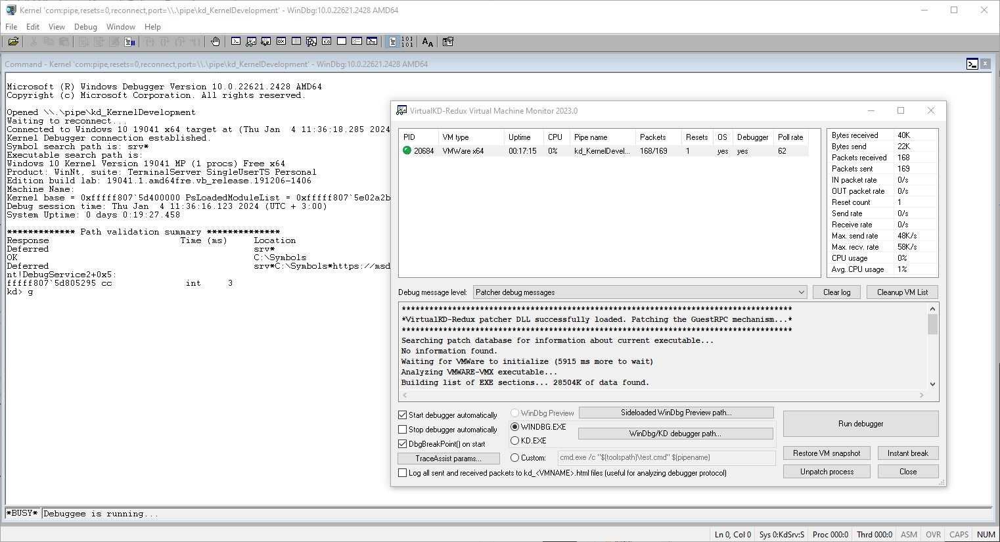
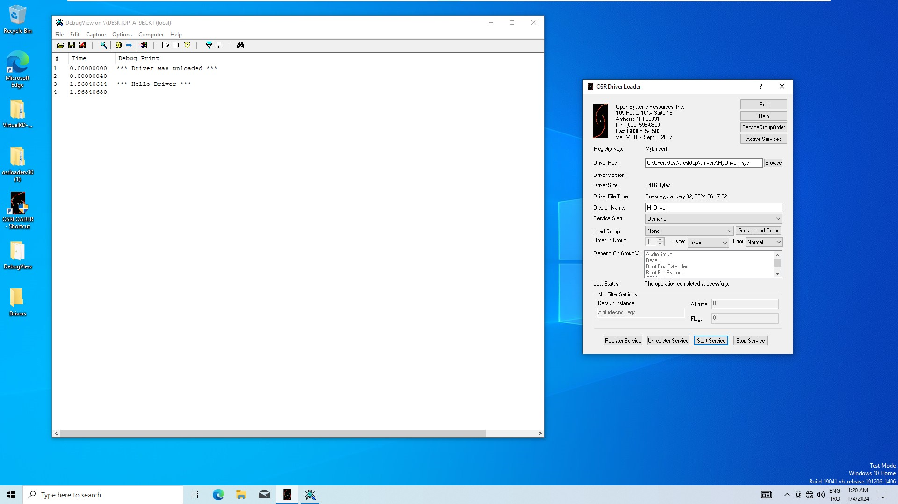

# Windows-Kernel-Driver-Development

Hi Folks, I created this repository 3 years ago althrough I haven't able to continue contribute. I aim to create a documentation on how to develop the kernel driver.

Enviroment Setup: 

| Host Machine | Virtual Machine |
| ------------- | ------------- |
| Visual Studio Community 2022 Preview   | DebugView  |
| Windows Software Development Kit (SDK)   | OSR Driver Loader  |
| Windows Driver Kit (WDK)  |VirtualKD-Redux Target Platform  |
| VirtualKD-Redux | - |
|  Windbg | -  |
| |

Requirements actions to be done for the Host Machine :

- Windows 10 Pro x64 22H2 19045.3803
- VirtualKD-Redux must be installed, İf wanted to use the latest version of VMware
- Windbg must be installed for debugging in Virtual Machine on the host machine 
- .sympath C:\Symbols;srv*C:\Symbols*https://msdl.microsoft.com/download/symbols

Requirements actions to be done for the Virtual Machine :

- Windows 10 Home x64 22H2 19045.2965
- bcdedit /set nointegritychecks on; bcdedit /set testsigning on
- HKEY_LOCAL_MACHINE\SYSTEM\CurrentControlSet\Control\Session Manager\Debug Print Filter\ DEFAULT :0xF

### Create Project

Before creating a project that we need to know what is the difference between WDM and KMDF. While Windows Driver Model (WDM) interacts directly with the operating system, Windows Driver Framework (WDF) focuses on how to handle most of the interactions with the system.

After creating a project and successfully building it, there is a need to change some of the properties.

- Set project architecture
- In the C/C++ section, change the warning level value to Level 1
- In the Linker section, change the Treat Linker Warning As Errors to No
- In the Driver Settings, change the Target Platform to Desktop and Target OS Version to according to your current operating system
- If after creating the solution, If you encounter the error "Device driver does not install on any devices, use primitive driver if this is intended." that is necessary to remove the Manufacturer value in the *.inf file.